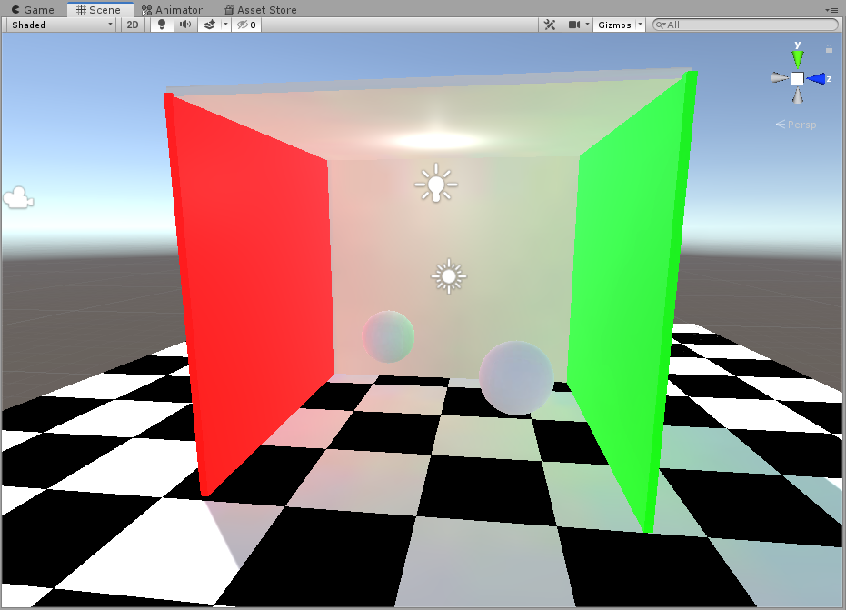

# Unity Mixed Lighting

Unity中有三种灯光模式：Realtime Lighting，Mixed Lighting，Bake Lighting。


**Realtime : ** 实时光照

**Mixed : ** 实时光照与烘焙混合使用

**Baked : ** 仅有烘焙灯光

其中Mixed Lighting较为复杂，因为处理实时灯光的同时还需要考虑烘焙出来的Lightmap的使用，Shader也更为复杂。Mixed Lighting又有三种模式：Bake Indirect, Subtractive, ShadowMask。

测试环境使用的LWRP，LWRP（6.5.3）中当前管线只支持**Subtractive**模式，我修改了LWRP的部分代码，以开启另外两种模式的Mixed Lighting。

`LightweightRenderPipeline.cs`

```c#
        static void SetSupportedRenderingFeatures()
        {
#if UNITY_EDITOR
            SupportedRenderingFeatures.active = new SupportedRenderingFeatures()
            {
                reflectionProbeModes = SupportedRenderingFeatures.ReflectionProbeModes.None,
                defaultMixedLightingModes = SupportedRenderingFeatures.LightmapMixedBakeModes.Subtractive,
                // mixedLightingModes = SupportedRenderingFeatures.LightmapMixedBakeModes.Subtractive,
                //TODO: vanCopper
                mixedLightingModes = SupportedRenderingFeatures.LightmapMixedBakeModes.Subtractive | 
                                    SupportedRenderingFeatures.LightmapMixedBakeModes.IndirectOnly |
                                    SupportedRenderingFeatures.LightmapMixedBakeModes.Shadowmask,
                lightmapBakeTypes = LightmapBakeType.Baked | LightmapBakeType.Mixed,
                lightmapsModes = LightmapsMode.CombinedDirectional | LightmapsMode.NonDirectional,
                lightProbeProxyVolumes = false,
                motionVectors = false,
                receiveShadows = false,
                reflectionProbes = true
            };
            SceneViewDrawMode.SetupDrawMode();
#endif
        }
```

### Bake Indirect

该模式下只烘焙间接光，其他全部为实时的。

##### 光照

|          | 直接光 |   间接光    |
| :------: | :----: | :---------: |
| 动态对象 | 实时光 | Light Probe |
| 静态对象 | 实时光 |  Lightmap   |

##### 阴影

|                 | 动态对象 Receiver  |                    | 静态对象 Receiver  |                    |
| :-------------: | :----------------: | :----------------: | :----------------: | :----------------: |
|                 | Shadow Distance 内 | Shadow Distance 外 | Shadow Distance 内 | Shadow Distance 外 |
| 动态对象 Caster |     Shadow map     |         无         |     Shadow map     |         无         |
| 静态对象 Caster |     Shadow map     |         无         |     Shadow map     |         无         |

实时光照 : 


Bake Indirect:



Bake Indirect模式优点是有实时阴影，有间接光照，缺点也很明显Shadow Distance外没阴影，因为Shadow Distance内光照和阴影都是实时计算，性能开销大。

### Subtractive

##### 光照

|          |  直接光  |   间接光    |
| :------: | :------: | :---------: |
| 动态对象 |  实时光  | Light Probe |
| 静态对象 | Lightmap |  Lightmap   |

##### 阴影

|                 | 动态对象 Receiver  |                    |   静态对象 Receiver   |                    |
| :-------------: | :----------------: | :----------------: | :-------------------: | :----------------: |
|                 | Shadow Distance 内 | Shadow Distance 外 |  Shadow Distance 内   | Shadow Distance 外 |
| 动态对象 Caster |     Shadow map     |         -          | Main light shadow map |         -          |
| 静态对象 Caster |    Light Probes    |    Light Probes    |       Lightmap        |      Lightmap      |


球体和立方体为动态物体，其他均为静态物体。可以看到间接光通过Light Probe也能获得不错的效果，但**Subatractive**有一个明显的问题，就是烘焙的阴影和实时光的阴影混合问题。如果实时光的产生的阴影比烘焙的阴影黑的话就会产生上面的可以看到两个阴影的问题。LWRP下**Subatractive**对于阴影的处理：

`Lighting.hlsl`

```c
half3 SubtractDirectMainLightFromLightmap(Light mainLight, half3 normalWS, half3 bakedGI)
{
    // Let's try to make realtime shadows work on a surface, which already contains
    // baked lighting and shadowing from the main sun light.
    // Summary:
    // 1) Calculate possible value in the shadow by subtracting estimated light contribution from the places occluded by realtime shadow:
    //      a) preserves other baked lights and light bounces
    //      b) eliminates shadows on the geometry facing away from the light
    // 2) Clamp against user defined ShadowColor.
    // 3) Pick original lightmap value, if it is the darkest one.


    // 1) Gives good estimate of illumination as if light would've been shadowed during the bake.
    // We only subtract the main direction light. This is accounted in the contribution term below.
    half shadowStrength = GetMainLightShadowStrength();
    half contributionTerm = saturate(dot(mainLight.direction, normalWS));
    half3 lambert = mainLight.color * contributionTerm;
    half3 estimatedLightContributionMaskedByInverseOfShadow = lambert * (1.0 - mainLight.shadowAttenuation);
    half3 subtractedLightmap = bakedGI - estimatedLightContributionMaskedByInverseOfShadow;

    // 2) Allows user to define overall ambient of the scene and control situation when realtime shadow becomes too dark.
    half3 realtimeShadow = max(subtractedLightmap, _SubtractiveShadowColor.xyz);
    realtimeShadow = lerp(bakedGI, realtimeShadow, shadowStrength);

    // 3) Pick darkest color
    return min(bakedGI, realtimeShadow);
}
```

`_SubtractiveShadowColor`就是在`Mixed Lighting->Realtime Shadow Color`中设置的用于控制场景阴影整体颜色的参数。调整后：


注意看阴影的部分。

**Subtractive**模式静态物体效果很好，并且阴影是直接烘焙在Lightmap中，阴影的渲染直接从Lightmap采样即可，节省性能。不好的地方是动态阴影与静态阴影的混合存在问题。

### Shadowmask

##### 光照 （Shadowmask 不使用Distance Shadowmask模式 ）

|          | 直接光 | 间接光     |
| :------: | ------ | ---------- |
| 动态对象 | 实时光 | LightProbe |
| 静态对象 | 实时光 | Lightmap   |

##### 阴影（Shadowmask 不使用Distance Shadowmask模式）

|                 | 动态对象 Receiver  |                    | 静态对象 Receiver  |                    |
| :-------------: | :----------------: | :----------------: | :----------------: | :----------------: |
|                 | Shadow Distance 内 | Shadow Distance 外 | Shadow Distance 内 | Shadow Distance 外 |
| 动态对象 Caster |     Shadow map     |         -          |     Shadow map     |         -          |
| 静态对象 Caster |    Light Probes    |    Light Probes    |     Shadowmask     |     Shadowmask     |

### Ref

>https://catlikecoding.com/unity/tutorials/rendering/part-17/
>
>http://ma-yidong.com/2017/09/02/mixed-lighting-lightmap-shader-in-unity/
>
>https://zhuanlan.zhihu.com/p/34477578
>
>https://docs.unity3d.com/Manual/LightMode-Mixed-Subtractive.html

